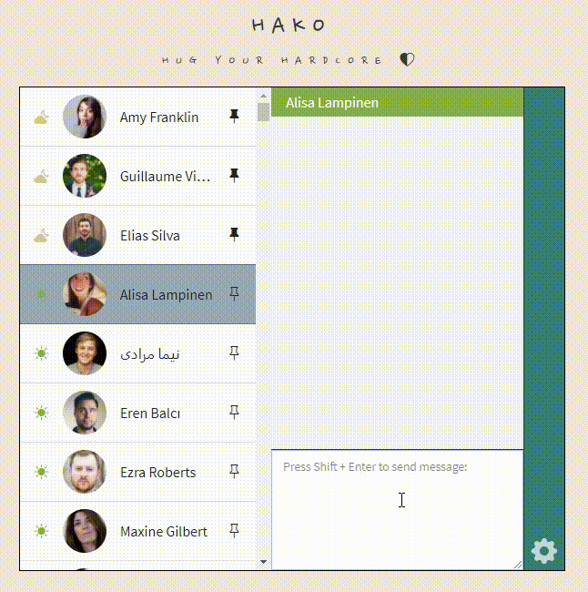
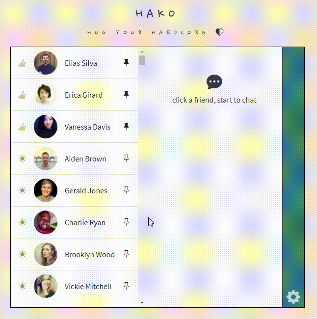
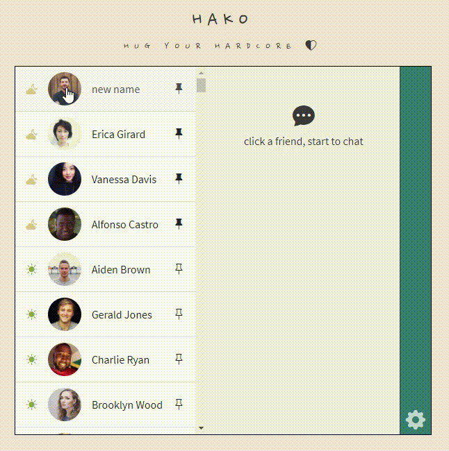
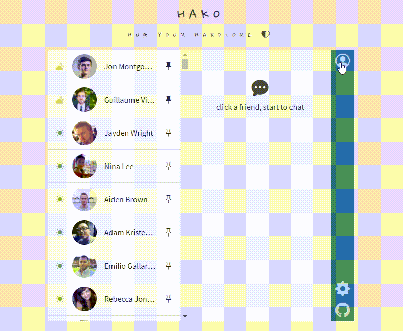

# HAKO 

## 專案連結
https://tzynwang.github.io/ac_practice_2-2_chat_room/

## 功能介紹
- 在線上的朋友會即時回應任何聊天訊息
  
  - 回應訊息透過 [Bacon Ipsum JSON API](https://baconipsum.com/json-api/) 產生
  - 回應訊息中的emoji透過 [Open Emoji Api](https://emoji-api.com/) 取得
- 可釘選（）特定朋友至左側訊息欄位最上方
  
- 訊息欄位由上至下的排序為：上線且被釘選的朋友、釘選的朋友、上線的朋友、其餘未上線且未被釘選的朋友
- 點選訊息欄位中朋友的大頭貼，可編輯朋友暱稱
  
  - 點選右下角的設定（），切換至Display標籤，可選擇是否顯示朋友暱稱
  - 若取消勾選，則一律顯示朋友原本的名字
- 使用者可上傳自己的頭貼、編輯自己的顯示名稱
  
- 可在設定中的Personal標籤中設定紀念日，若當天日期為紀念日日期，在載入本APP時會出現紀念日訊息
  - 使用者若有登錄自己的顯示名稱，紀念日訊息會提到使用者的名字

## License
MIT 